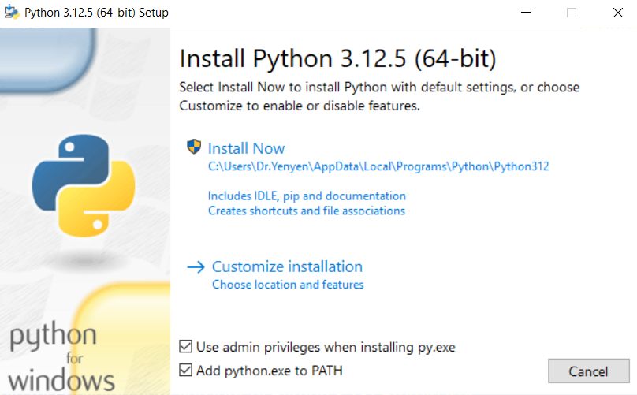

# PPPwn-Tinker-GUI
PPPwn-Tkinter-GUI was crafted with the goal of extending the functionality of the current PPPwn solutions. By altering the way in which the exploit is deployed and run, one can increase reliability of **Scanning for corrupted object** to nearly 100%. This is often console-dependent, but it's better to experiment than not.

At present, PPPwn-Tkinter-GUI was made with Windows in mind. Hopefully this will be built upon soon. As it stands, there aren't any options to "save" a configuration, but this will also hopefully be added soon.

This tool is open-source and provided as-is. Under the hood it utilizes new functionality added to PPPwn_cpp by nn9dev with the help of Borris_ta (and is also open source!) 
     
Please be sure to read the instructions carefully, and happy tinkering!
       
Furthermore, the pppwn_cpp additions can be integrated into other pppwn solutions (raspi, luckfox, etc.) with just a few extra command line arguments. Using [this fork](https://github.com/nn9dev/PPPwn_cpp/releases/tag/1.1-b1), grab the latest release and run pppwn --help to see the additional flags.       

# Installing Dependencies for C++ version
1. Download and install [Npcap1.79](https://npcap.com/#download)    
# Installing Dependencies For Python version
1. Download and install [Python](https://www.python.org/downloads/)
Make sure to add it to path and install as admin           
         
2. Then run the following commands in a CMD window        
```   
python -m ensurepip --default-pip
```    
```
pip install scapy
```    

# Downloading the GUI 
1. Go to [Releases](https://github.com/DrYenyen/PPPwn-Tinker-GUI/releases/tag/V1) download the zip file and extract it to your folder of choice then run the PPPwn Tinker.exe      
2. if Windows Defender flags the zip or any files allow them through.
This is because GUI  tools house the the exploit  which is known by security software https://hackerone.com/reports/2177925    
3. Turn on your PS4 and connect it to your PC via ethernet.      

# Setting up the PS4 internet connection  
On your PS4  
1. Go to **Settings** and then **Network**   
2. Select **Set Up Internet connection** and choose Use a **LAN Cable**  
3. Choose **Custom** setup and choose **PPPoE** for IP Address Settings  
4. Put in anything as **Username** and ***Password*** 
5. Choose **Automatic** for *DNS Settings* and *MTU Settings*
6. Choose **Do not use** for *Proxy Server*   
7. Go back and be ready to press on *Test internet connection*       
      
# Putting the goldhen or VTX payload on a usb        
Format a usb drive to exFAT               
Find the folder for your firmware and from inside of it copy the goldhen.bin file onto your usb drive  for Goldhen         
Find the folder for your firmware and from inside of it copy the payload.bin file onto your usb drive  For VTX        
Then plug the usb into your PS4         
         
# How to use the new options Corrupt Num, Pin Num and Spray Num
#  Corrupt Num
1. Corrupt Num increases the is the amount of overflow packets sent to the PS4. Enter in hex OR decimal. (Default: 0x1 or 1)
The reccomended HEX values are 0x1 0x2, 0x4, 0x6, 0x8, 0x10, 0x14, 0x20, 0x30, 0x40 but you are free to test and find out what works best for your console. Ocassionally values too high may cause console crashes work back down to something stable.
# Pin Num 
1. No information about it untested if it helps but is available if you'd like to try. Enter in hex OR decimal. (Default: 0x1000 or 4096)
# Spray num
1. When spray is higher the scan range is larger. Enter in hex OR decimal. (Default: 0x1000 or 4096)(pending better description)       
The reccomended HEX values are  0x1000, 0x1050, 0x1100, 0x1150, 0x1200, 0x1250 but you are free to test and find out what works best for your console.

# PPPwn-Tinker C++ Instructions          
1. Choose your ethernet interface      
To find it you can look in        
Settings>Network & Internet>**Ethernet** on the left menu>Then Click on the connection name scroll down and fine the Description      
2. Select the firmware version your PS4 is on        
3. PPPwn version C++ is the default option       
4. Usually not using the old IPV6 version is reccomended but if your console experienses crashes with no progress past Stage 2 tick it to use the old IPV6 
5. You can tweak the Num settings in all 3 fields based on the instructions above.    
6. You can press the **Run PPPwn** button and on your PS4 press on **Test internet connection**        
7. See [Troubleshooting for help](https://github.com/DrYenyen/PPPwn-Tinker-GUI#troubleshooting)      
      
   
# PPPwn-Tinker Python Instructions         
1. Choose your ethernet interface          
To find it you can look in         
Settings>Network & Internet>**Ethernet** on the left menu>Then Click on the connection name scroll down and fine the Description      
2. Select the firmware version your PS4 is on     
3. To select the Python version click on the dropdown menu and choose **Python**    
4. Python does not have the option to use the old IPV6.      
5. Python does not have support for tweaking the Num values left blank or with writing in it will not result in errors or additions to the command.  
6. You can press the **Run PPPwn** button and on your PS4 press on **Test internet connection**      
7. See [Troubleshooting for help](https://github.com/DrYenyen/PPPwn-Tinker-GUI#troubleshooting)   


# Troubleshooting 
1. If the script gets stuck at [*] Waiting for interface to be ready... restart the exploit process
2. If the script gets stuck at [+] Pinning to CPU XX...done restart the exploit process
3. If the script is stuck on 
[+] Scanning for corrupted object...found fe80::0fdf:4141:4141:4141
[+] STAGE 2: KASLR defeat
[*] Defeating KASLR...
and your console crashes try changing to the old IPV6
4. If the script is stuck on [*] Waiting for IPCP configure ACK... and your console crashes try changing to the old IPV6
5. If the script gets stuck on any of the following 
[*] Sending LCP configure ACK...
[*] Sending LCP configure request...
[*] Waiting for LCP configure ACK...
[*] Waiting for IPCP configure request...
[*] Sending IPCP configure NAK...
[*] Waiting for IPCP configure request...
[*] Sending IPCP configure ACK...
[*] Sending IPCP configure request...
[*] Waiting for IPCP configure ACK...
[*] Waiting for interface to be ready...     
 Restart the exploit process
 6. If you are on a newly set-up machine you may need to install the latest .Net framework       
 7. Any further problems you can open an Issue if you'd like or contact me on Twitter [Dr.Yenyen](https://x.com/calmboy2019?t=eGJv6yJ4XvwogFCpV_T5SA&s=09)   

# Credits    
[TheOfficialFloW for PPPwn](https://github.com/TheOfficialFloW/PPPwn)      
[xfangfang for C++ rewrite](https://github.com/xfangfang/PPPwn_cpp?tab=readme-ov-file)   
[nn9dev for the C++ changes](https://github.com/nn9dev/PPPwn_cpp/releases/tag/1.1-b1)   
[Borris-ta for his help](https://github.com/Borris-ta)   
Thank you to Beta testers of the GUI Sausig, Rust, and nn9dev.    